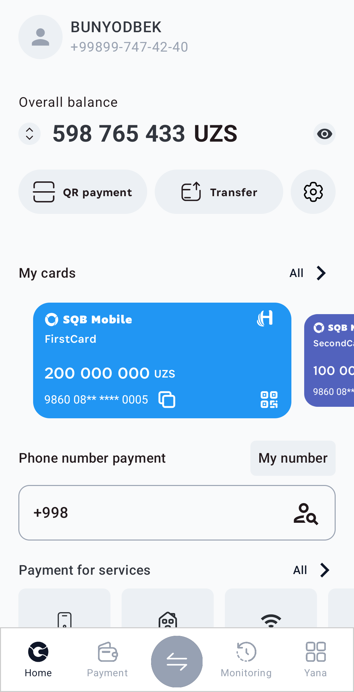
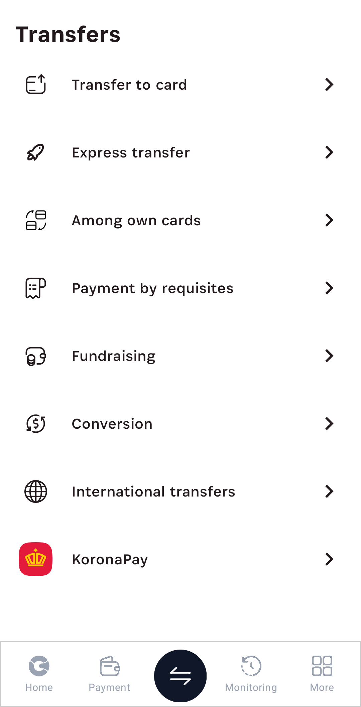
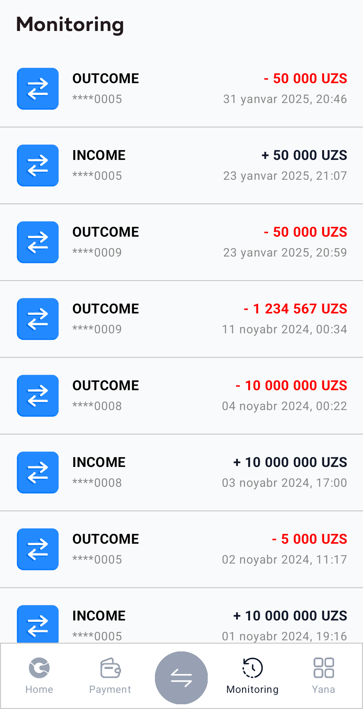
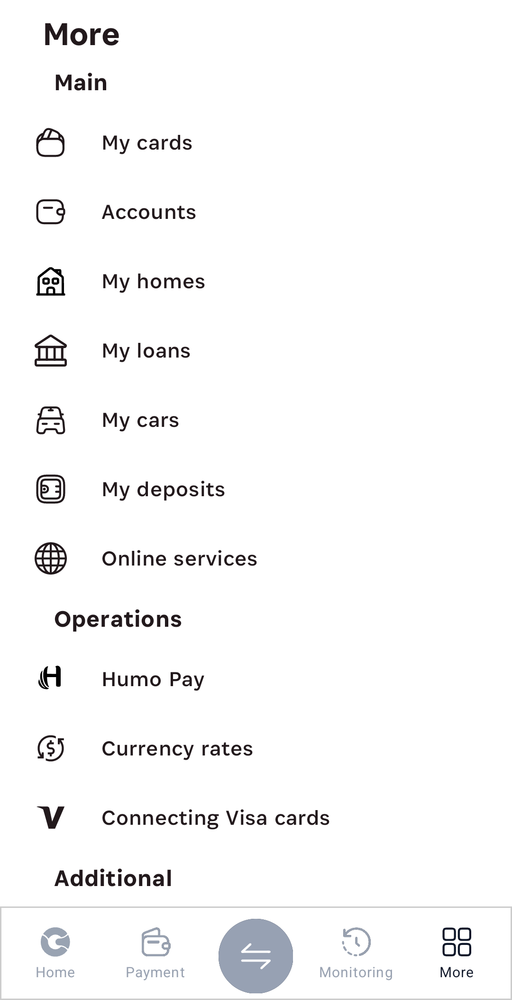

# SQB Mobile Banking App

SQB Mobile is an Android banking application designed to provide users with a seamless and secure banking experience. It includes essential banking features, multi-language support, and a modern UI.

## 💳 Features

- **Sign In & Sign Up** 🔐
- **Account Verification & PIN Code Setup** ✅
- **Card Management (Add, Delete, Update, Read)** 💳
- **Transfer Money & View Transfer History** 🔄
- **Profile Management** 👤
- **Last Transfer & Transfer Verification** 🔍
- **Multi-Language Support (English, Russian, Uzbek)** 🌍

## 🛠 Technologies Used

- **Multi-Module Architecture** for Scalability 🏗️
- **Retrofit & OkHttp** for Secure API Communication 🌐
- **Authenticator for Access & Refresh Tokens** 🔑
- **Hilt** for Dependency Injection 🔧
- **Pagination for Efficient Data Handling** 📄
- **Caching (Local & Retrofit) for Performance Optimization** ⚡
- **Jetpack Compose for Modern UI** 🎨
- **MVI Architecture** for State Management 🏛️
- **Voyager for Navigation** 🚀
- **OAuth2 for Secure Authentication** 🔒
- **Orbit for Reactive State Management** ⚡

## 📸 Screenshots

Below are some screenshots of the application:

<table>
  <tr>
    <td></td>
    <td></td>
    <td></td>
  </tr>
<tr>
    <td></td>
    <td></td>
  </tr>
</table>

## 🚀 Try the App

Download the APK and try it out.

---

**Author: Imotdinov Bunyodbek**  
**Contact: [imotdinovbunyodbek2@gmail.com](mailto:imotdinovbunyodbek2@gmail.com)