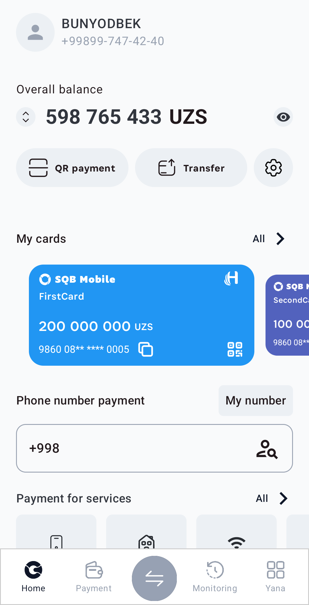
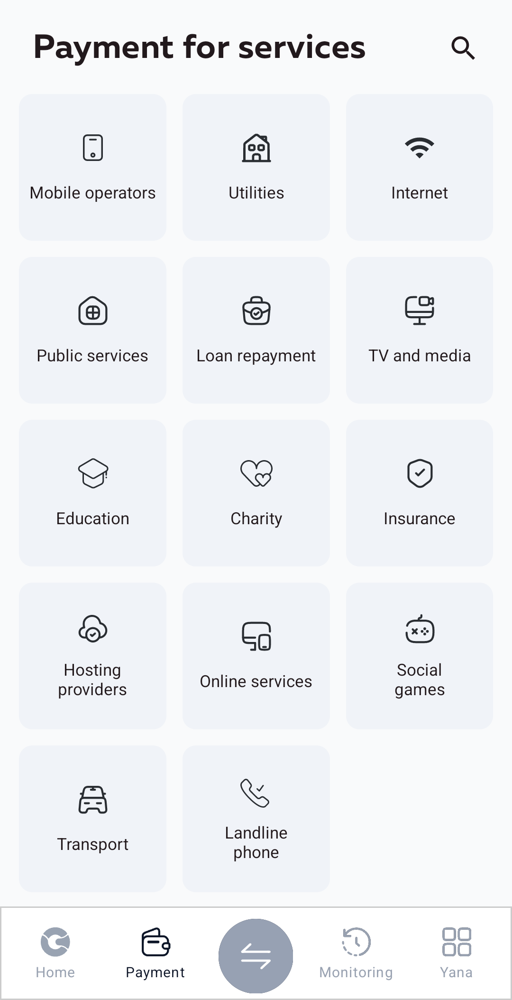
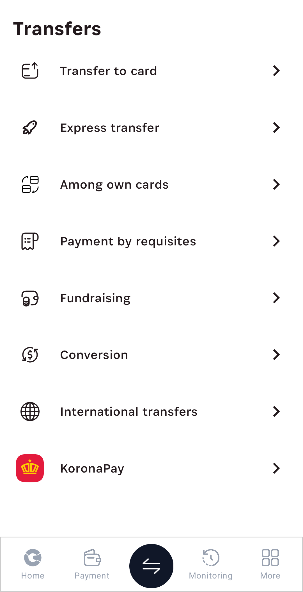
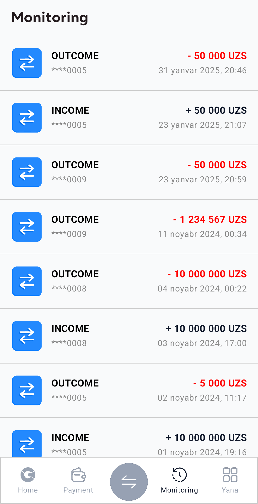
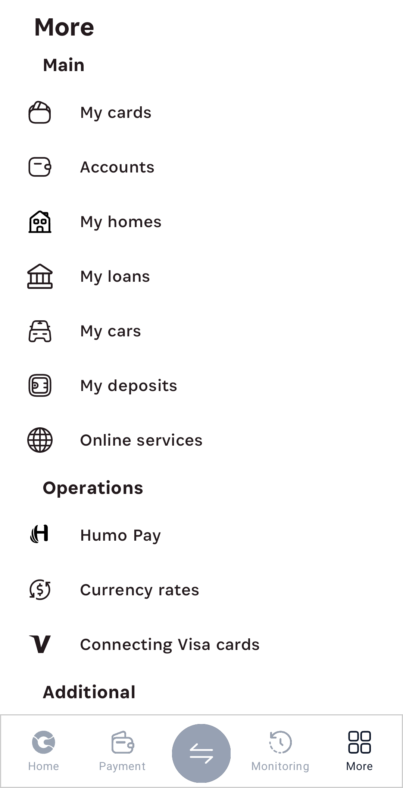

# SQB Mobile Banking App

**SQB Mobile** is a modern Android banking application designed to deliver a fast, secure, and intuitive financial experience. With essential banking features, multi-language support, and a sleek UI, SQB Mobile simplifies your digital banking.

## 💳 Key Features

- 🔐 **Sign In & Sign Up**
- ✅ **Account Verification & PIN Code Setup**
- 💳 **Card Management** (Add, Delete, Update, View)
- 🔄 **Transfer Money & View Transaction History**
- 👤 **Profile Management**
- 🔍 **Last Transfer & Transfer Verification**
- 🌍 **Multi-Language Support** (Uzbek, English, Russian)

> 📌 **Note**: To complete registration and perform money transfers, please activate the [@MobileBankNewSmsCodeBot](https://t.me/MobileBankNewSmsCodeBot) on Telegram. It is required to receive verification codes via SMS.  
📞 For support: **+998 95 008 40 48**

---

## 🛠 Technologies Used

- 🏗 **Multi-Module Architecture** – for better scalability
- 🌐 **Retrofit & OkHttp** – secure API communication
- 🔑 **Authenticator** – handles access & refresh tokens
- 🔧 **Hilt** – dependency injection
- 📄 **Pagination** – for efficient data loading
- ⚡ **Caching** – using both Local and Retrofit mechanisms
- 🎨 **Jetpack Compose** – for a modern, responsive UI
- 🏛 **MVI Architecture** – for managing app state cleanly
- 🚀 **Voyager** – for seamless navigation
- 🔒 **OAuth2** – for secure authentication
- ⚡ **Orbit** – reactive state management

---

## 📸 Screenshots

<table>
  <tr>
    <td></td>
    <td></td>
    <td></td>
  </tr>
  <tr>
    <td></td>
    <td></td>
  </tr>
</table>

---

## 🚀 Try the App

Download the APK and experience the future of mobile banking.

---

## 🔐 Test Login Credentials

- **Phone**: `+998997474240`
- **Password**: `Imotdinov7777`

---

**Author:** *Imotdinov Bunyodbek*  
**Contact:** [imotdinovbunyodbek2@gmail.com](mailto:imotdinovbunyodbek2@gmail.com)
